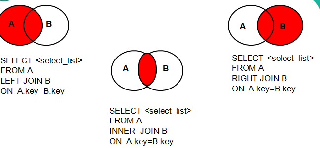

# DQL

DQL就是数据查询语言，数据库执行DQL语句不会对数据进行改变，而是让数据库发送结果集给客户端。

## 1.基础查询

语法：

```mysql
select 查询列表 from 表名;
```

特点：

1.查询的结果集是一个虚拟表，不会对原有的数据表进行修改

2.select后面跟的查询列表，可以由多部分组成，中间用逗号隔开

例如：select 字段1，字段2，表达式 from 表；

3.执行顺序

①from字句

②select字句

4.查询列表可以是：字段、表达式、常量、函数等

demo:

```sql
#一、查询常量
SELECT 100 ;

#二、查询表达式
SELECT 100%3;

#三、查询单个字段
SELECT `last_name` FROM `employees`;

#四、查询多个字段
SELECT `last_name`,`email`,`employee_id` FROM employees;

#五、查询所有字段
SELECT * FROM `employees`;

# 对齐格式
SELECT 
    `last_name`,
    `first_name`,
    `last_name`,
    `commission_pct`,
    `hiredate`,
    `salary` 
FROM
    employees ;

#六、查询函数（调用函数，获取返回值）
SELECT DATABASE();
SELECT VERSION();
SELECT USER();

#七、起别名
#方式一：使用as关键字
SELECT USER() AS 用户名;
SELECT USER() AS "用户名";
SELECT USER() AS '用户名';
SELECT last_name AS "姓 名" FROM employees;

#方式二：使用空格
SELECT USER()   用户名;
SELECT USER()   "用户名";
SELECT USER()   '用户名';
SELECT last_name   "姓 名" FROM employees;

#八、+的作用
-- 需求：查询 first_name 和last_name 拼接成的全名，最终起别名为：姓 名
#方案1：使用+    pass×
SELECT first_name+last_name AS "姓 名"
FROM employees;

#方案2：使用concat拼接函数
SELECT CONCAT(first_name,last_name) AS "姓 名"
FROM employees;

mysql中+的作用：
1、加法运算
①两个操作数都是数值型
100+1.5
②其中一个操作数为字符型
将字符型数据强制转换成数值型,如果无法转换，则直接当做0处理
'张无忌'+100===>100
③其中一个操作数为null
null+null====》null
null+100====》 null

#九、distinct的使用 去重复
#需求：查询员工涉及到的部门编号有哪些
SELECT DISTINCT department_id FROM employees;

#十、查看表的结构
DESC employees;
SHOW COLUMNS FROM employees;  # 查询列信息
```


## 2.条件查询

语法：

```sql
select 查询列表;
from 表名;
where 筛选条件;
```

执行顺序:

①from子句

②where 子句

③select子句

特点：

1.按照关系表达式筛选

关系运算符：>,<,>=,<=,=,<>

2.按逻辑运算符筛选

逻辑运算符: and,or,not

3.模糊查询

**like：**
功能：一般和通配符搭配使用，对字符型数据进行部分匹配查询
常见的通配符：
_ 任意单个字符
% 任意多个字符,支持0-多个
like/not like 


**in：**

功能：查询某字段的值是否属于指定的列表之内

a  in(常量值1,常量值2,常量值3,...)
a not in(常量值1,常量值2,常量值3,...)

in/not in


**between...and：**

功能：判断某个字段的值是否介于xx之间

between and/not between and


**isnull：**

功能：判断字段是否为null值

is null/is not null

=：只能判断普通的内容

IS：只能判断NULL值

<=>  ：安全等于，既能判断普通内容，又能判断NULL值

demo:

```sql

#一、按关系表达式筛选
#案例1：查询部门编号不是100的员工信息
SELECT *
FROM employees
WHERE department_id <> 100;

#案例2：查询工资<15000的姓名、工资
SELECT last_name,salary
FROM employees
WHERE salary<15000;

#二、按逻辑表达式筛选
#案例1：查询部门编号不是 50-100之间员工姓名、部门编号、邮箱
#方式1：
SELECT last_name,department_id,email
FROM employees
WHERE department_id <50 OR department_id>100;

#方式2：
SELECT last_name,department_id,email
FROM employees
WHERE NOT(department_id>=50 AND department_id<=100);

#案例2：查询奖金率>0.03 或者 员工编号在60-110之间的员工信息
SELECT *
FROM employees
WHERE commission_pct>0.03 OR (employee_id >=60 AND employee_id<=110);

#三、模糊查询

#1、like
#案例1：查询姓名中包含字符a的员工信息
SELECT *
FROM employees
WHERE last_name LIKE '%a%';

#案例2：查询姓名中包含最后一个字符为e的员工信息
SELECT *
FROM employees
WHERE last_name LIKE '%e';

#案例3：查询姓名中包含第一个字符为e的员工信息
SELECT *
FROM employees
WHERE last_name LIKE 'e%';

#案例4：查询姓名中包含第三个字符为x的员工信息
SELECT *
FROM employees
WHERE last_name LIKE '__x%';

#案例5：查询姓名中包含第二个字符为_的员工信息
SELECT *
FROM employees
WHERE last_name LIKE '_\_%';

SELECT *
FROM employees
WHERE last_name LIKE '_$_%' ESCAPE '$';

#2、in
#案例1：查询部门编号是30/50/90的员工名、部门编号
#方式1：
SELECT last_name,department_id
FROM employees
WHERE department_id IN(30,50,90);

#方式2：

SELECT last_name,department_id
FROM employees
WHERE department_id = 30
OR department_id = 50
OR department_id = 90;


#案例2：查询工种编号不是SH_CLERK或IT_PROG的员工信息
#方式1：
SELECT *
FROM employees
WHERE job_id NOT IN('SH_CLERK','IT_PROG');

#方式2：
SELECT *
FROM employees
WHERE NOT(job_id ='SH_CLERK'
OR job_id = 'IT_PROG');

#3、between ... and
#方式1：
SELECT department_id,last_name
FROM employees
WHERE department_id BETWEEN 30 AND 90;

#方式2：
SELECT department_id,last_name
FROM employees
WHERE department_id>=30 AND department_id<=90;


#案例2：查询年薪不是100000-200000之间的员工姓名、工资、年薪
#方式1：
SELECT last_name,salary,salary*12*(1+IFNULL(commission_pct,0)) 年薪
FROM employees
WHERE salary*12*(1+IFNULL(commission_pct,0))<100000 OR salary*12*(1+IFNULL(commission_pct,0))>200000;

#方式2：
SELECT last_name,salary,salary*12*(1+IFNULL(commission_pct,0)) 年薪
FROM employees
WHERE salary*12*(1+IFNULL(commission_pct,0)) NOT BETWEEN 100000 AND 200000;

#4、is null/is not null
#案例1：查询没有奖金的员工信息
SELECT *
FROM employees
WHERE commission_pct IS NULL;


#案例2：查询有奖金的员工信息
方法1:
SELECT *
FROM employees
WHERE commission_pct IS NOT NULL;

方法2:
SELECT *
FROM employees
WHERE salary IS 10000;
#----------------对比------------------------------------

=		只能判断普通的内容

IS              只能判断NULL值

<=>             安全等于，既能判断普通内容，又能判断NULL值


SELECT *
FROM employees
WHERE salary <=> 10000;

SELECT *
FROM employees
WHERE commission_pct <=> NULL;
```


## 3.排序查询

语法：

```sql
select 查询列表
from 表名
where 筛选条件
order by 排序列表;
```


执行顺序：

①from子句
②where子句
③select子句
④order by 子句


特点：

1、排序列表可以是单个字段、多个字段、表达式、函数、列数、以及以上的组合
2、升序 ，通过 asc   ，默认行为
   降序 ，通过 desc

demo:

```sql
#一、按单个字段排序
#案例1：将员工编号>120的员工信息进行工资的升序
SELECT * 
FROM employees 
ORDER BY salary ;

#案例1：将员工编号>120的员工信息进行工资的降序
SELECT * 
FROM employees 
WHERE employee_id>120 
ORDER BY salary DESC;

#二、按表达式排序
#案例1：对有奖金的员工，按年薪降序
SELECT *,salary*12*(1+IFNULL(commission_pct,0))  年薪
FROM employees
WHERE commission_pct IS NOT NULL
ORDER BY salary*12*(1+IFNULL(commission_pct,0)) DESC;


#三、按别名排序
#案例1：对有奖金的员工，按年薪降序
SELECT *,salary*12*(1+IFNULL(commission_pct,0))  年薪
FROM employees
ORDER BY 年薪 DESC;

#四、按函数的结果排序
#案例1：按姓名的字数长度进行升序
SELECT last_name
FROM employees
ORDER BY LENGTH(last_name);


#五、按多个字段排序
#案例1：查询员工的姓名、工资、部门编号，先按工资升序，再按部门编号降序

SELECT last_name,salary,department_id
FROM employees
ORDER BY salary ASC,department_id DESC;


#六、补充选学：按列数排序
SELECT * FROM employees 
ORDER BY 2 DESC;

SELECT * FROM employees 
ORDER BY first_name;
```


## 4.函数

结构：

```sql
select 函数
from 表名
where 筛选条件
order by 排序列表;
```


为了解决某个问题，将编写的一系列的命令集合封装在一起，对外仅仅暴露方法名，供外部调用

1、自定义方法(函数)
2、调用方法(函数)★
	叫什么  ：函数名
	干什么  ：函数功能

MySQL数据库提供了很多函数包括：

### <1>.字符函数

| 函数                                | 函数含义                                                     |
| ----------------------------------- | ------------------------------------------------------------ |
| **CONCAT(S1,S2,......,Sn)**         | 连接S1,S2,......,Sn为一个字符串                              |
| **CONCAT(s, S1,S2,......,Sn)**      | 同CONCAT(s1,s2,...)函数，但是每个字符串之间要加上s           |
| **CHAR_LENGTH(s)**                  | 返回字符串s的字符数                                          |
| **LENGTH(s)**                       | 返回字符串s的字节数，和字符集有关                            |
| **INSERT(str, index , len, instr)** | 将字符串str从第index位置开始，len个字符长的子串替换为字符串instr |
| **UPPER(s) 或 UCASE(s)**            | 将字符串s的所有字母转成大写字母                              |
| **LOWER(s)  或LCASE(s)**            | 将字符串s的所有字母转成小写字母                              |
| **LEFT(s,n)**                       | 返回字符串s最左边的n个字符                                   |
| **RIGHT(s,n)**                      | 返回字符串s最右边的n个字符                                   |
| **LPAD(str, len, pad)**             | 用字符串pad对str最左边进行填充，直到str的长度为len个字符     |
| **RPAD(str ,len, pad)**             | 用字符串pad对str最右边进行填充，直到str的长度为len个字符     |
| LTRIM(s)                            | 去掉字符串s左侧的空格                                        |
| RTRIM(s)                            | 去掉字符串s右侧的空格                                        |
| **TRIM(s)**                         | 去掉字符串s开始与结尾的空格                                  |
| **TRIM(【BOTH 】s1 FROM s)**        | 去掉字符串s开始与结尾的s1                                    |
| **TRIM(【LEADING】s1 FROM s)**      | 去掉字符串s开始处的s1                                        |
| **TRIM(【TRAILING】s1 FROM s)**     | 去掉字符串s结尾处的s1                                        |
| REPEAT(str, n)                      | 返回str重复n次的结果                                         |
| REPLACE（str, a, b）                | 用字符串b替换字符串str中所有出现的字符串a                    |
| **STRCMP(s1,s2)**                   | 比较字符串s1,s2                                              |
| **SUBSTRING(s,index,len)**          | 返回从字符串s的index位置其len个字符                          |

demo:

```sql
# 字符函数
# 1.concat拼接字符
select concat('hello',`first_name`,last_name) 备注
from employees;

# 2.length获取字节长度
select length('hello,郭襄');

# 3.获取字符长度
select CHAR_LENGTH('hello,郭襄');

# 4.SUBSTRING 截取子串
/*
注意：起始索引从1开始！！！
substr(str,起始索引，截取的字符长度)
substr(str,起始索引)
sql中起始索引为1
*/
SELECT SUBSTRING("张三丰爱上郭襄",1,3);
select substr("张三丰爱上郭襄",6,2);

# 5.instr获取字符第一次出现的索引
SELECT INSTR('三打白骨精aaa白骨精bb白骨精','白骨精');

# 6、TRIM去前后指定的字符，默认是去空格
SELECT TRIM(' 虚  竹    ')  AS a;
SELECT TRIM('x' FROM 'xxxxxx虚xxx竹xxxxxxxxxxxxxxxxxx')  AS a;

# 7.LPAD/RPAD  左填充/右填充
SELECT LPAD('木婉清',10,'a');
SELECT RPAD('木婉清',10,'a');

# 8、UPPER/LOWER  变大写/变小写
#案例：查询员工表的姓名，要求格式：姓首字符大写，其他字符小写，名所有字符大写，且姓和名之间用_分割，最后起别名“OUTPUT”
select concat(upper(SUBSTR(first_name,1,1)),lower(SUBSTR(first_name,2)),'_',upper(last_name)) output
from employees;

# 9、STRCMP 比较两个字符大小
# 比较循序，先比第一个，在二前面比后面大1，和面比前面大-1相同0
select strcmp('aec','aec');

# 10、LEFT/RIGHT  截取子串
SELECT LEFT('鸠摩智',1);
SELECT RIGHT('鸠摩智',1);
```


### <2>.数学函数

| 函数          | 函数含义                             |
| ------------- | ------------------------------------ |
| ABS（x）      | 返回x的绝对值                        |
| CEIL（x）     | 返回大于x的最小整数值                |
| FLOOR（x）    | 返回大于x的最大整数值                |
| MOD(x,y)      | 返回x/y的模                          |
| RAND(x)       | 返回0~1的随机值                      |
| ROUND(x,y)    | 返回参数x的四舍五入的有y位的小数的值 |
| TRUNCATE(x,y) | 返回数字x截断为y位小数的结果         |
| SQRT(x)       | 返回x的平方根                        |
| POW(x,y)      | 返回x的y次方                         |

demo:

```sql
# 1.ABS绝对值
select ABS(-2.4);

# 2、CEIL 向上取整  返回>=该参数的最小整数
select ceil(-1.09);
select ceil(0.09);
select ceil(1.00);

# 3、FLOOR 向下取整，返回<=该参数的最大整数
select floor(-1.09);
select floor(0.09);
select floor(1.00);

# 4、ROUND 四舍五入
SELECT ROUND(1.8712345);
SELECT ROUND(1.8712345,2);

# 5、TRUNCATE 截断
SELECT TRUNCATE(1.8712345,1);

# 6、MOD 取余
SELECT MOD(-10,3);
```


### <3>.日期函数

| 函数                                                         | 函数含义                                               |
| ------------------------------------------------------------ | ------------------------------------------------------ |
| CURDATE() 或 CURRENT_DATE()                                  | 返回当前日期                                           |
| CURTIME() 或 CURRENT_TIME()                                  | 返回当前时间                                           |
| NOW() SYSDATE()CURRENT_TIMESTAMP()LOCALTIME()LOCALTIMESTAMP() | 返回当前系统日期时间                                   |
| YEAR(date)MONTH(date)DAY(date)HOUR(time)MINUTE(time)SECOND(time) | 返回具体的时间值                                       |
| WEEK(date)WEEKOFYEAR(date)                                   | 返回一年中的第几周                                     |
| DAYOFWEEK()                                                  | 返回周几，注意：周日是1，周一是2，。。。周六是7        |
| WEEKDAY(date)                                                | 返回周几，注意，周1是0，周2是1，。。。周日是6          |
| DAYNAME(date)                                                | 返回星期：MONDAY,TUESDAY.....SUNDAY                    |
| MONTHNAME(date)                                              | 返回月份：January，。。。。。                          |
| DATEDIFF(date1,date2)TIMEDIFF(time1, time2)                  | 返回date1 - date2的日期间隔返回time1 - time2的时间间隔 |
| DATE_ADD(datetime, INTERVALE  expr  type)                    | 返回与给定日期时间相差INTERVAL时间段的日期时间         |
| DATE_FORMAT(datetime ,fmt)                                   | 按照字符串fmt格式化日期datetime值                      |
| STR_TO_DATE(str, fmt)                                        | 按照字符串fmt对str进行解析，解析为一个日期             |

**（1）DATE_ADD(datetime,INTERVAL  expr  type)**

| 表达式                                                       | 表达式类型    |
| ------------------------------------------------------------ | ------------- |
| SELECT DATE_ADD(NOW(), INTERVAL 1 YEAR);<br />SELECT DATE_ADD(NOW(), INTERVAL -1 YEAR);  #可以是负数<br />SELECT DATE_ADD(NOW(), INTERVAL '1_1' YEAR_MONTH);  #需要单引号 |               |
| 表达式类型                                                   | YEAR_MONTH    |
| YEAR                                                         | DAY_HOUR      |
| MONTH                                                        | DAY_MINUTE    |
| DAY                                                          | DAY_SECOND    |
| HOUR                                                         | HOUR_MINUTE   |
| MINUTE                                                       | HOUR_SECOND   |
| SECOND                                                       | MINUTE_SECOND |

**（2）DATE_FORMAT(datetime ,fmt)和STR_TO_DATE(str, fmt)**

| 格式符 | 说明                                                        | 格式符 | 说明                                                        |
| ------ | ----------------------------------------------------------- | ------ | ----------------------------------------------------------- |
| %Y     | 4位数字表示年份                                             | %y     | 表示两位数字表示年份                                        |
| %M     | 月名表示月份（January,....）                                | %m     | 两位数字表示月份（01,02,03。。。）                          |
| %b     | 缩写的月名（Jan.，Feb.，....）                              | %c     | 数字表示月份（1,2,3,...）                                   |
| %D     | 英文后缀表示月中的天数（1st,2nd,3rd,...）                   | %d     | 两位数字表示月中的天数(01,02...)                            |
| %e     | 数字形式表示月中的天数（1,2,3,4,5.....）                    |        |                                                             |
| %H     | 两位数字表示小数，24小时制（01,02..）                       | %h和%I | 两位数字表示小时，12小时制（01,02..）                       |
| %k     | 数字形式的小时，24小时制(1,2,3)                             | %l     | 数字形式表示小时，12小时制（1,2,3,4....）                   |
| %i     | 两位数字表示分钟（00,01,02）                                | %S和%s | 两位数字表示秒(00,01,02...)                                 |
| %W     | 一周中的星期名称（Sunday...）                               | %a     | 一周中的星期缩写（Sun.，Mon.,Tues.，..）                    |
| %w     | 以数字表示周中的天数(0=Sunday,1=Monday....)                 |        |                                                             |
| %j     | 以3位数字表示年中的天数(001,002...)                         | %U     | 以数字表示年中的第几周，（1,2,3。。）其中Sunday为周中第一天 |
| %u     | 以数字表示年中的第几周，（1,2,3。。）其中Monday为周中第一天 |        |                                                             |
| %T     | 24小时制                                                    | %r     | 12小时制                                                    |
| %p     | AM或PM                                                      | %%     | 表示%                                                       |

demo:

```sql
# 1.now获取当前时间
select now();

# 2.curdate 获取当前年月日
select curdate();

# 3.curtime 获取当前时间十分秒
select curtime();

# 4.datediff 获取两个时间间隔天数
SELECT DATEDIFF('1998-7-16','2020-7-13');

# 5.timediff 获取两个时间之间间隔
select timediff('13:14:15','12:16:19');

# 6.date_format 格式化时间
SELECT DATE_FORMAT('1998-7-16','%Y年%M月%d日 %H小时%i分钟%s秒') 出生日期;

SELECT DATE_FORMAT(hiredate,'%Y年%m月%d日 %H小时%i分钟%s秒')入职日期 
FROM employees;


# 7.str_to_date 按指定格式解析字符串为日期类型
SELECT * FROM employees
WHERE hiredate<STR_TO_DATE('3/15 1998','%m/%d %Y');
```


### <4>.流程控制函数

| 函数                                                         | 函数解释                                     |
| ------------------------------------------------------------ | -------------------------------------------- |
| IF(value,t ,f)                                               | 如果value是真，返回t，否则返回f              |
| IFNULL(value1, value2)                                       | 如果value1不为空，返回value1，否则返回value2 |
| CASE <br />WHEN 条件1 THEN <br />result1<br />WHEN 条件2 THEN <br />result2....<br />[ELSE resultn]<br />END | 相当于Java的if...else if...                  |
| CASE  expr <br />WHEN 常量值1 THEN 值1<br />WHEN 常量值1 THEN 值1....<br />[ELSE 值n]<br />END | 相当于Java的switch                           |

 demo:

```sql
# 1.if
select if(100>9,'好','坏');

#需求：如果有奖金，则显示最终奖金，如果没有，则显示0
select if(commission_pct is null,0,salary*commission_pct*12) 最终奖金
from employees;

# 2、CASE函数
/*
①情况1 ：类似于switch语句，可以实现等值判断
CASE 表达式
WHEN 值1 THEN 结果1
WHEN 值2 THEN 结果2
...
ELSE 结果n
END
*/
/*案例：
部门编号是30，工资显示为2倍
部门编号是50，工资显示为3倍
部门编号是60，工资显示为4倍
否则不变

显示 部门编号，新工资，旧工资*/
select department_id 部门编号, 
case department_id
when 30 then salary*2
when 50 then salary*3
when 60 then salary*4
else salary
end 新工资, salary 旧工资
from employees;

/*
②情况2：类似于多重IF语句，实现区间判断
CASE 
WHEN 条件1 THEN 结果1
WHEN 条件2 THEN 结果2
...

ELSE 结果n

END
*/
/*
案例：如果工资>20000,显示级别A
      工资>15000,显示级别B
      工资>10000,显示级别C
      否则，显示D
*/

select salary 工资,
case
when salary>20000 then 'A'
when salary>15000 then 'B'
when salary>10000 then 'C'
else 'D'
END
as 工资级别
from employees;
```


### <5>.分组(聚合)函数

说明：分组函数往往用于实现将一组数据进行统计计算，最终得到一个值，又称为聚合函数或统计函数

- **COUNT()：统计指定列不为NULL的记录行数；**
- MAX()：计算指定列的最大值，如果指定列是字符串类型，那么使用字符串排序运算；
- MIN()：计算指定列的最小值，如果指定列是字符串类型，那么使用字符串排序运算；
- SUM()：计算指定列的数值和，如果指定列类型不是数值类型，那么计算结果为0；
- AVG()：计算指定列的平均值，如果指定列类型不是数值类型，那么计算结果为0；

demo:

```sql
# 案例1 ：查询员工信息表中，所有员工的工资和、工资平均值、最低工资、最高工资、有工资的个数
select sum(salary) 所有员工的工资和,avg(salary) 工资平均值,min(salary) 最低工资,max(salary) 最高工资,count(salary) 有工资的个数
from employees;

#案例2：添加筛选条件
#①查询emp表中记录数：
select count(`employee_id`)
from `employees`;

#②查询emp表中有佣金的人数：
select count(`salary`)
from `employees`;

#③查询emp表中月薪大于2500的人数：
select count(`salary`)
from `employees`
where salary >2500;

#④查询有领导的人数：
select count(`manager_id`)
from `employees`;
```

**count的补充介绍★**

**1、统计结果集的行数，推荐使用count(*)**

```sql
SELECT COUNT(*) FROM employees;
SELECT COUNT(*) FROM employees WHERE department_id = 30;

SELECT COUNT(1) FROM employees;
SELECT COUNT(1) FROM employees WHERE department_id = 30;
```

**2、搭配distinct实现去重的统计**

```sql
#需求：查询有员工的部门个数
SELECT COUNT(DISTINCT department_id) FROM employees;


#思考：每个部门的总工资、平均工资？
SELECT SUM(salary)  FROM employees WHERE department_id = 30;
SELECT SUM(salary)  FROM employees WHERE department_id = 50;


SELECT SUM(salary) ,department_id
FROM employees
GROUP BY department_id;
```


## 5.分组查询

结构：

```sql
select 查询列表
from 表名
where 筛选条件
group by 分组列表
having 分组后筛选
order by 排序列表;
```

执行顺序：
①from子句
②where子句
③group by 子句
④having子句
⑤select子句
⑥order by子句

特点：
①查询列表往往是  分组函数和被分组的字段 ★
②分组查询中的筛选分为两类

筛选的基表	使用的关键词		               位置
分组前筛选		原始表		where			group by 的前面

分组后筛选		分组后的结果集  having		group by的后面

where——group by ——having

问题：分组函数做条件只可能放在having后面！！！

demo:

```sql
#1）简单的分组
#案例1：查询每个工种的员工平均工资

SELECT AVG(salary),job_id
FROM employees
GROUP BY job_id;

#案例2：查询每个领导的手下人数

SELECT COUNT(*),manager_id
FROM employees
WHERE manager_id IS NOT NULL
GROUP BY manager_id;


#2）可以实现分组前的筛选
#案例1：查询邮箱中包含a字符的 每个部门的最高工资
SELECT MAX(salary) 最高工资,department_id
FROM employees
WHERE email LIKE '%a%'
GROUP BY department_id;


#案例2：查询每个领导手下有奖金的员工的平均工资
SELECT AVG(salary) 平均工资,manager_id
FROM employees
WHERE commission_pct IS NOT NULL
GROUP BY manager_id;


#3）可以实现分组后的筛选
#案例1：查询哪个部门的员工个数>5
#分析1：查询每个部门的员工个数
SELECT COUNT(*) 员工个数,department_id
FROM employees
GROUP BY department_id

#分析2：在刚才的结果基础上，筛选哪个部门的员工个数>5

SELECT COUNT(*) 员工个数,department_id
FROM employees

GROUP BY department_id
HAVING  COUNT(*)>5;


#案例2：每个工种有奖金的员工的最高工资>12000的工种编号和最高工资

SELECT job_id,MAX(salary)
FROM employees
WHERE commission_pct  IS NOT NULL
GROUP BY job_id
HAVING MAX(salary)>12000;


#案例3：领导编号>102的    每个领导手下的最低工资大于5000的最低工资
#分析1：查询每个领导手下员工的最低工资
SELECT MIN(salary) 最低工资,manager_id
FROM employees
GROUP BY manager_id;

#分析2：筛选刚才1的结果
SELECT MIN(salary) 最低工资,manager_id
FROM employees
WHERE manager_id>102
GROUP BY manager_id
HAVING MIN(salary)>5000 ;


#4）可以实现排序
#案例：查询没有奖金的员工的最高工资>6000的工种编号和最高工资,按最高工资升序
#分析1：按工种分组，查询每个工种有奖金的员工的最高工资
SELECT MAX(salary) 最高工资,job_id
FROM employees
WHERE commission_pct IS  NULL
GROUP BY job_id


#分析2：筛选刚才的结果，看哪个最高工资>6000
SELECT MAX(salary) 最高工资,job_id
FROM employees
WHERE commission_pct IS  NULL
GROUP BY job_id
HAVING MAX(salary)>6000


#分析3：按最高工资升序
SELECT MAX(salary) 最高工资,job_id
FROM employees
WHERE commission_pct IS  NULL
GROUP BY job_id
HAVING MAX(salary)>6000
ORDER BY MAX(salary) ASC;


#5）按多个字段分组
#案例：查询每个工种每个部门的最低工资,并按最低工资降序
#提示：工种和部门都一样，才是一组
SELECT MIN(salary) 最低工资,job_id,department_id
FROM employees
GROUP BY job_id,department_id
order by min(salary) desc;
```


## 6.连接查询

**说明：又称多表查询，当查询语句涉及到的字段来自于多个表时，就会用到连接查询**

笛卡尔乘积现象：表1 有m行，表2有n行，结果=m*n行

发生原因：没有有效的连接条件
如何避免：添加有效的连接条件

**分类：**

按年代分类：
1、sql92标准:仅仅支持内连接
内连接：
		等值连接
		非等值连接
		自连接

2、sql99标准【推荐】：支持内连接+外连接（左外和右外）+交叉连接
	内连接：
		等值连接
		非等值连接
		自连接
	外连接：
		左外连接
		右外连接
		全外连接
	交叉连接

### <1>.92标准

#### 1.1.内连接：

**语法:**

```sql
select 查询列表
from 表1 别名,表2 别名
where 连接条件
and 筛选条件
group by 分组列表
having 分组后筛选
order by 排序列表
```

执行顺序：

1、from子句
2、where子句
3、and子句
4、group by子句
5、having子句
6、select子句
7、order by子句

##### 1.1.1.等值连接

**①多表等值连接的结果为多表的交集部分**
**②n表连接，至少需要n-1个连接条件**
**③多表的顺序没有要求**
**④一般需要为表起别名**
**⑤可以搭配前面介绍的所有子句使用，比如排序、分组、筛选d**

demo:

```sql
#案例1：查询女神名和对应的男神名
SELECT NAME,boyName 
FROM boys,beauty
WHERE beauty.boyfriend_id= boys.id;

#案例2：查询员工名和对应的部门名

SELECT last_name,department_name
FROM employees,departments
WHERE employees.`department_id`=departments.`department_id`;


#2、为表起别名
/*
①提高语句的简洁度
②区分多个重名的字段

注意：如果为表起了别名，则查询的字段就不能使用原来的表名去限定

*/
#查询员工名、工种号、工种名

SELECT e.last_name,e.job_id,j.job_title
FROM employees  e,jobs j
WHERE e.`job_id`=j.`job_id`;


#3、两个表的顺序是否可以调换

#查询员工名、工种号、工种名

SELECT e.last_name,e.job_id,j.job_title
FROM jobs j,employees e
WHERE e.`job_id`=j.`job_id`;


#4、可以加筛选


#案例：查询有奖金的员工名、部门名

SELECT last_name,department_name,commission_pct

FROM employees e,departments d
WHERE e.`department_id`=d.`department_id`
AND e.`commission_pct` IS NOT NULL;

#案例2：查询城市名中第二个字符为o的部门名和城市名

SELECT department_name,city
FROM departments d,locations l
WHERE d.`location_id` = l.`location_id`
AND city LIKE '_o%';

#5、可以加分组


#案例1：查询每个城市的部门个数

SELECT COUNT(*) 个数,city
FROM departments d,locations l
WHERE d.`location_id`=l.`location_id`
GROUP BY city;


#案例2：查询有奖金的每个部门的部门名和部门的领导编号和该部门的最低工资
SELECT department_name,d.`manager_id`,MIN(salary)
FROM departments d,employees e
WHERE d.`department_id`=e.`department_id`
AND commission_pct IS NOT NULL
GROUP BY department_name,d.`manager_id`;
#6、可以加排序


#案例：查询每个工种的工种名和员工的个数，并且按员工个数降序

SELECT job_title,COUNT(*)
FROM employees e,jobs j
WHERE e.`job_id`=j.`job_id`
GROUP BY job_title
ORDER BY COUNT(*) DESC;


#7、可以实现三表连接？

#案例：查询员工名、部门名和所在的城市

SELECT last_name,department_name,city
FROM employees e,departments d,locations l
WHERE e.`department_id`=d.`department_id`
AND d.`location_id`=l.`location_id`
AND city LIKE 's%'

ORDER BY department_name DESC;
```

##### 1.1.2.非等值连接

```sql
#案例1：查询员工的工资和工资级别


SELECT salary,grade_level
FROM employees e,job_grades g
WHERE salary BETWEEN g.`lowest_sal` AND g.`highest_sal`
AND g.`grade_level`='A';
```


##### 1.1.3.非等值自连接

```sql
#案例：查询 员工名和上级的名称

SELECT e.employee_id,e.last_name,m.employee_id,m.last_name
FROM employees e,employees m
WHERE e.`manager_id`=m.`employee_id`;
```


### <2>.99标准

#### 2.1.内连接：

**语法:**

```sql
SELECT 查询列表
FROM 表名1 别名
【INNER】 JOIN  表名2 别名
ON 连接条件
WHERE 筛选条件
GROUP BY 分组列表
HAVING 分组后筛选
ORDER BY 排序列表;
```

执行顺序：

1、from子句
2、[inner join] 子句
3、on 子句
4、where子句
5、group by子句
6、having子句
7、select子句
8、order by子句

**SQL92和SQL99的区别：**

	SQL99，使用JOIN关键字代替了之前的逗号，并且将连接条件和筛选条件进行了分离，提高阅读性！！！

#####  2.1.1.等值连接

```sql
#①简单连接
#案例：查询员工名和部门名

SELECT last_name,department_name
FROM departments d 
 JOIN  employees e 
ON e.department_id =d.department_id;


#②添加筛选条件
#案例1：查询部门编号>100的部门名和所在的城市名
SELECT department_name,city
FROM departments d
JOIN locations l
ON d.`location_id` = l.`location_id`
WHERE d.`department_id`>100;


#③添加分组+筛选
#案例1：查询每个城市的部门个数

SELECT COUNT(*) 部门个数,l.`city`
FROM departments d
JOIN locations l
ON d.`location_id`=l.`location_id`
GROUP BY l.`city`;


#④添加分组+筛选+排序
#案例1：查询部门中员工个数>10的部门名，并按员工个数降序

SELECT COUNT(*) 员工个数,d.department_name
FROM employees e
JOIN departments d
ON e.`department_id`=d.`department_id`
GROUP BY d.`department_id`
HAVING 员工个数>10
ORDER BY 员工个数 DESC;
```


##### 2.1.2.非等值连接

```sql
#案例：查询部门编号在10-90之间的员工的工资级别，并按级别进行分组
SELECT * FROM sal_grade;


SELECT COUNT(*) 个数,grade
FROM employees e
JOIN sal_grade g
ON e.`salary` BETWEEN g.`min_salary` AND g.`max_salary`
WHERE e.`department_id` BETWEEN 10 AND 90
GROUP BY g.grade;
```


##### 2.1.3.非等值自连接

```sql
#案例：查询员工名和对应的领导名

SELECT e.`last_name`,m.`last_name`
FROM employees e
JOIN employees m
ON e.`manager_id`=m.`employee_id`;
```


#### 2.2.外连接：

说明：查询结果为主表中所有的记录，如果从表有匹配项，则显示匹配项；如果从表没有匹配项，则显示null

应用场景：一般用于查询主表中有但从表没有的记录

特点：

1、外连接分主从表，两表的顺序不能任意调换
2、左连接的话，left join左边为主表
   右连接的话，right join右边为主表

语法：

```sql
select 查询列表
from 表1 别名
left|right|full 【outer】 join 表2 别名
on 连接条件
where 筛选条件;
```

demo:

```sql
# 案例1：查询所有女神记录，以及对应的男神名，如果没有对应的男神，则显示为null
# 左连接
select b.*,bo.*
from beauty b
left join boys bo
on b.`boyfriend_id` = bo.`id`;

# 右连接
select b.*,bo.*
from beauty b
right join boys bo
on b.`boyfriend_id` = bo.`id`;

# 案例2：查哪个女神没有男朋友
# 左连接
select b.*,bo.*
from beauty b
left join boys bo
on b.`boyfriend_id` = bo.`id`
where bo.`id` is null;

# 右连接
select b.*,bo.*
from beauty b
right join boys bo
on b.`boyfriend_id` = bo.`id`
where bo.`id` is null;

# 案例3：查询哪个部门没有员工，并显示其部门编号和部门名
select d.department_id,d.department_name
from employees e
right join departments d
on e.`department_id` = d.`department_id`
where e.`employee_id` is null;
```

### <3>.总结




## 7.子查询

说明：当一个查询语句中又嵌套了另一个完整的select语句，则被嵌套的select语句称为子查询或内查询
外面的select语句称为主查询或外查询。


分类：

按子查询出现的位置进行分类：

1、select后面
	要求：子查询的结果为单行单列（标量子查询）
2、from后面
	要求：子查询的结果可以为多行多列
3、where或having后面 ★
	要求：子查询的结果必须为单列
		单行子查询
		多行子查询
4、exists后面
	要求：子查询结果必须为单列（相关子查询）
	
特点：
	1、子查询放在条件中，要求必须放在条件的右侧
	2、子查询一般放在小括号中
	3、子查询的执行优先于主查询
	4、单行子查询对应了 单行操作符：> < >= <= = <>
	   多行子查询对应了 多行操作符：any/some  all in   

### <1>、单行子查询

```sql
# 案例1：谁的工资比 Abel 高?
select `last_name`,`salary`
from employees
where salary >(
	select salary
	from employees
	where `last_name` ='Abel'
) ;


# 案例2：返回job_id与141号员工相同，salary比143号员工多的员工姓名，job_id 和工资
select last_name,job_id,salary
from employees
where job_id = (
	select job_id
	from employees
	where `employee_id` = 141
	) and salary > (
		select salary
		from employees
		where `employee_id` = 143
	
	);
	
# 案例3：返回公司工资最少的员工的last_name,job_id和salary
select last_name,job_id,salary
from employees
where salary = (
	select min(salary)
	from employees
);

# 案例4：查询最低工资大于50号部门最低工资的部门id和其最低工资
select `department_id`,min(salary)
from employees
GROUP BY `department_id`
having MIN(salary) >(
	select min(salary)
	from employees
	where department_id =50
);
```

### <2>、多行子查询

**in**:判断某字段是否在指定列表内  
x in(10,30,50)

**any/some**:判断某字段的值是否满足其中任意一个

x>any(10,30,50)
x>min()

x=any(10,30,50)
x in(10,30,50)

**all**:判断某字段的值是否满足里面所有的

x >all(10,30,50)
x >max()

```sql
# 案例1：返回location_id是1400或1700的部门中的所有员工姓名
select last_name 
from employees
where department_id in (
	select DISTINCT department_id
	from departments
	where location_id in (1400,1700)	
);

# 案例2：返回其它部门中比job_id为‘IT_PROG’部门任一工资低的员工的员工号、姓名、job_id 以及salary
select employee_id 员工号, last_name 姓名,job_id,salary
from employees
where salary < any (
	select DISTINCT salary
	from employees
	where job_id = 'IT_PROG'
);

# 等价于：
select employee_id 员工号, last_name 姓名,job_id,salary
from employees
where salary < (
	select max(salary)
	from employees
	where job_id = 'IT_PROG'
);

# 案例3：返回其它部门中比job_id为‘IT_PROG’部门所有工资都低的员工 的员工号、姓名、job_id 以及salary
select employee_id 员工号, last_name 姓名,job_id,salary
from employees
where salary < all (
	select DISTINCT salary
	from employees
	where job_id = 'IT_PROG'
);

# 等价于：
select employee_id 员工号, last_name 姓名,job_id,salary
from employees
where salary < (
	select min(salary)
	from employees
	where job_id = 'IT_PROG'
);
```

### <3>、子查询在不同位置

#### 3.1.where后面

```sql
# 案例：谁的工资比 Abel 高?
select last_name,salary
from employees
where salary > (
	select salary
	from employees
	where last_name ='Abel'
);
```

#### 3.2.having后面

```sql
# 案例：查询最低工资大于50号部门最低工资 的部门id和其最低工资
select department_id 部门id,min(salary) 最低工资
from employees
GROUP BY department_id
having min(salary) > (
	select min(salary)
	from employees
	where department_id =50
);
```

#### 3.3.select之后

 ```sql
# 案例；查询部门编号是50的员工个数
select (
	select count(*)
	from employees
	where department_id =50
) 员工个数;
 ```

#### 3.4.放在from之后

```sql
案例：查询每个部门的平均工资的工资级别
# 1.查询每个部门的平均工资
select avg(salary)
from employees
group by department_id;


# 2.查询工资级别合并查询
select  avg_sal.sal,g.grade
from sal_grade g 
inner join (
	select avg(salary) sal
	from employees
	group by department_id
) avg_sal on avg_sal.sal BETWEEN g.min_salary and g.max_salary;
```

#### 3.5.放在exists后面

```sql
#案例1 ：查询有无名字叫“张三丰”的员工信息
SELECT EXISTS(
	SELECT * 
	FROM employees
	WHERE last_name = 'Abel'

) 有无Abel;


#案例2：查询没有女朋友的男神信息
SELECT bo.*
FROM boys bo
WHERE bo.`id` NOT IN(
	SELECT boyfriend_id
	FROM beauty b
)

SELECT bo.*
FROM boys bo
WHERE NOT EXISTS(
	SELECT boyfriend_id
	FROM beauty b
	WHERE bo.id = b.boyfriend_id
);
```

### <4>.综合案例

```sql
#1. 查询和 Zlotkey 相同部门的员工姓名和工资
select last_name,salary
from employees
where department_id = (
	select department_id
	from employees
	where last_name = 'Zlotkey'
);


#2. 查询工资比公司平均工资高的员工的员工号，姓名和工资。
select employee_id 员工号,last_name 姓名,salary 工资
from employees
where salary > (
	select avg(salary)
	from employees
);
```


## 8.分页查询

**应用场景：**当页面上的数据，一页显示不全，则需要分页显示

分页查询的sql命令请求数据库服务器——>服务器响应查询到的多条数据——>前台页面


语法：

```sql
select 查询列表
from 表1 别名
join 表2 别名
on 连接条件
where 筛选条件
group by 分组
having 分组后筛选
order by 排序列表
limit 起始条目索引,显示的条目数
```

执行顺序：

```sql
1》from子句
2》join子句
3》on子句
4》where子句
5》group by子句
6》having子句
7》select子句
8》order by子句
9》limit子句
```

**特点：**
①起始条目索引如果不写，默认是0
②limit后面支持两个参数
参数1：显示的起始条目索引
参数2：条目数

**公式：**

假如要显示的页数是page，每页显示的条目数为size

select *
from employees
limit (page-1)*size,size;

page	size=10
1                       limit 0,10
2			limit 10,10
3			limit 20,10
4			limit 30,10

```sql
# 案例1：查询员工信息表的前5条
select *
from employees
LIMIT 5;
# 等价于
select *
from employees
LIMIT 0,5;

# 案例2：查询有奖金的，且工资较高的第11名到第20名
select *
from employees
where commission_pct is not null
order by salary desc
LIMIT 10,10;
```


## 9.联合查询

说明：当查询结果来自于多张表，但多张表之间没有关联，这个时候往往使用联合查询，也称为union查询

**语法：**

```sql
select 查询列表 from 表1  where 筛选条件  
	union
select 查询列表 from 表2  where 筛选条件  
```

**特点：**

1、多条待联合的查询语句的查询列数必须一致，查询类型、字段意义最好一致
2、union实现去重查询
   union all 实现全部查询，包含重复项

```sql
#案例：查询所有国家的年龄>20岁的用户信息

SELECT * FROM usa WHERE uage >20 UNION
SELECT * FROM chinese WHERE age >20 ;


#案例2：查询所有国家的用户姓名和年龄

SELECT uname,uage FROM usa
UNION
SELECT age,`name` FROM chinese;


#案例3：union自动去重/union all 可以支持重复项
SELECT 1,'范冰冰' 
UNION ALL
SELECT 1,'范冰冰' 
UNION  ALL
SELECT 1,'范冰冰' 
UNION  ALL
SELECT 1,'范冰冰' ;
```


